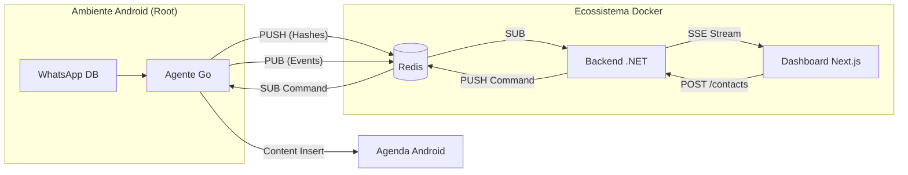

# 📱 Intelitrader Desafio Técnico: WhatsApp Data Sync

[](Docs/processo.md)
[](Docs/Sobre-Gustavo.md)
[](TECH_GUIDE.md)

Este repositório contém a solução completa para o **Desafio Técnico de Integração e Monitoramento Android Real-Time**, proposto pela **Intelitrader**.

O projeto evoluiu de uma prova de conceito para uma plataforma robusta de sincronização, integrando extração de dados de baixo nível no Android, processamento assíncrono via Redis e visualização em tempo real em um Dashboard moderno.

---

## 🎯 Status do Desafio

### Agente Nativo (Android/Golang)

- [x] **Leitura Real-time**: Monitoramento do SQLite (`msgstore.db`) via Observers + Polling Fallback.
- [x] **SQL Avançado**: Resolução de identidades (LID to PN) e extração de nomes salvos.
- [x] **Integração Redis**: Push de mensagens via Hashes e Notificação via Pub/Sub.
- [x] **Persistência Android**: Resiliência contra OOM Killer e Doze Mode.

### Interface Externa (C# .NET & Next.js)

- [x] **Backend .NET**: API Minimal com suporte a SSE (Server-Sent Events) para streaming de mensagens.
- [x] **Frontend Next.js**: Dashboard responsivo com telemetria em tempo real e animações de tráfego.
- [x] **API de Contatos**: Endpoint `POST /contacts` para inserção remota via Redis.

---

## 🔭 Arquitetura da Solução

O sistema opera em uma arquitetura orientada a eventos (Event-Driven) distribuída em containers:



---

## 🛠️ Tecnologias Utilizadas

- **Agente Nativo:** Golang (Cross-compiled para Android x86_64/ARM64).
- **Backend:** C# (.NET 10 Minimal API).
- **Frontend:** Next.js 15 (App Router, TailwindCSS, Lucide React).
- **Infraestrutura:** Docker & Docker Compose.
- **Banco de Dados/Broker:** Redis.

---

## 🚀 Como Executar

### 1. Requisitos

- Docker & Docker Compose instalados.
- Emulador Android com acesso Root (configurado no IP `10.0.2.2`).

### 2. Subir a Infraestrutura

```bash
docker-compose up -d
```

Isso iniciará o **Redis**, o **Backend .NET** e o **Frontend Next.js**.

- Dashboard: `http://localhost:3000`
- API Backend: `http://localhost:5000`
- Redis exposto em: `localhost:6379`

### 3. Executar o Agente no Android

Navegue até `lab/adb-connection/` e utilize o script de deploy automatizado:

```bash
bash deploy.sh
```

---

## 📚 Documentação Detalhada

O projeto foi rigorosamente documentado para facilitar a revisão técnica e o entendimento das decisões de design:

- 👤 **[Sobre o Candidato](Docs/Sobre-Gustavo.md)**: Perfil generalista, mentalidade autodidata e uso de IA com diferencial.
- 📝 **[Registro de Processo](Docs/processo.md)**: O diário de bordo completo, da Etapa 001 à Etapa 005.
- 🏗️ **[Guia Técnico (TECH_GUIDE.md)](TECH_GUIDE.md)**: Explicação profunda da arquitetura, stack e fluxos de dados.
- 🧪 **[Reflexão Técnica e Padrões](Docs/processo.md#etapa-005-reflexão-e-triangulação-técnica)**: Mapeamento de padrões (Strangler Fig, Debounce, PoC-Driven) aplicados intuitivamente.
- 🚧 **[Dificuldades Encontradas](Docs/dificuldades.md)**: Como limitações do Android e concorrência em Go foram superadas.
