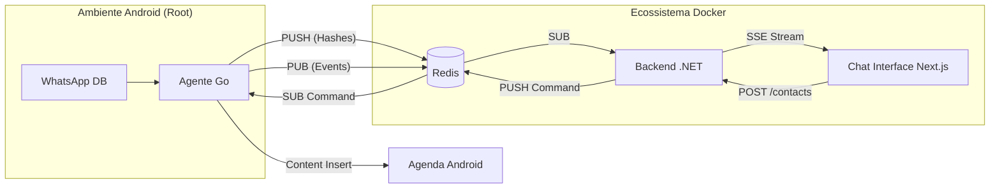

# 📱 Intelitrader Desafio Técnico: WhatsApp Data Sync

[](Docs/processo.md)
[](Docs/Sobre-Gustavo.md)
[](TECH_GUIDE.md)

Este repositório contém a solução completa para o **Desafio Técnico de Integração e Monitoramento Android Real-Time**, proposto pela **Intelitrader**.

O projeto evoluiu de uma prova de conceito para uma plataforma robusta de sincronização, integrando extração de dados de baixo nível no Android, processamento assíncrono via Redis e visualização em tempo real em um Dashboard moderno.

---

## 🎯 Status do Desafio

### Agente Nativo (Android/Golang)

- [x] **Leitura em tempo real**: Monitoramento do SQLite (`msgstore.db`) via Observers + Polling Fallback.
- [x] **SQL Refinado**: Resolução de identidades (LID - Local ID e PN - Phone Number) e extração de nomes salvos.
- [x] **Integração com Redis**: Push de mensagens via Hashes e notificação de inserção via Pub/Sub.
- [x] **Persistência Android**: Resiliência contra OOM Killer e Doze Mode.

### Interface Externa (C# .NET & Next.js)

- [x] **Backend .NET**: API Minimal com suporte a SSE (Server-Sent Events) e **Validação Estrita de Dados** (Regex para números de telefone).
- [x] **Frontend Next.js**: Interface de **Chat Moderna** (WhatsApp-like) com sidebar de conversas, bolhas de chat e auto-scroll.
- [x] **Categorização Visual**: Badges automáticas para identificar **GRUPOS** e conversas **PRIVADAS**.
- [x] **Identidade Visual**: Integração com a **API do GitHub** para exibição dinâmica do perfil do desenvolvedor.
- [x] **Endpoint de Contatos**: Fluxo completo de injeção remota via Redis e Agente Nativo.

---

## 🔭 Arquitetura da Solução

O sistema opera em uma arquitetura orientada a eventos (Event-Driven) distribuída em containers:



---

## 🛠️ Tecnologias Utilizadas

- **Agente Nativo:** Golang (Cross-compiled para Android x86_64/ARM64 com NDK - Native Development Kit).
- **Backend:** C# (.NET 10 Minimal API).
- **Frontend:** Next.js 15 (App Router, TailwindCSS, Lucide React, Framer Motion).
- **Infraestrutura:** Docker & Docker Compose.
- **Banco de Dados/Broker:** Redis.

---

## 🚀 Como Executar

### 1. Requisitos

- Docker & Docker Compose instalados.
- Emulador Android com acesso Root (configurado no IP `10.0.2.2`).

### 2. Subir a Infraestrutura

Navegue até a pasta `WhatsAppSync` e suba os containers Docker:

```bash
cd WhatsAppSync
docker-compose up -d
```

Isso iniciará o **Redis**, o **Backend .NET**, o **Frontend Next.js** e o **Nginx**.

- Dashboard (Chat): `http://localhost:3000`
- API Backend: `http://localhost:5000`
- Redis exposto em: `localhost:6379`

### 3. Executar o Agente no Android

Navegue até a pasta do agente e utilize o script de deploy automatizado:

```bash
cd WhatsAppSync/agent/
bash deploy.sh
```

Ainda usando o terminal, execute o agente garantindo acesso root:

```bash
adb root

cd WhatsAppSync/agent/
sudo ./whatsapp-agent
```

### 4. Usando aplicação externa:

Após realizar os passos anteriores, você pode acessar o painel de chat em `http://localhost:3000`. Você verá as conversas sendo sincronizadas em tempo real. O sistema utiliza **Server-Sent Events (SSE)** para garantir que cada nova mensagem do Android apareça instantaneamente na bolha de chat correspondente, sem necessidade de refresh.

### 5. Testes de Caos e Estresse (Chaos Engineering)

Para validar a blindagem da arquitetura, suba o container de testes isolados. Ele metralhará o Redis com cargas massivas e tentativas de injeção Shell/SQL para testar a resiliência do Agente Go:

> (Atenção: esse comando vai inserir 50 contatos no emulador, se testar em um telefone não voltado para testes, cuidado para não poluir sua agenda!)

```bash
docker-compose --profile test up chaos-tester
```

---

## 📚 Documentação Detalhada

O projeto foi rigorosamente documentado para facilitar a revisão técnica e o entendimento das decisões de design:

- 👤 **[Sobre o Candidato](Docs/Sobre-Gustavo.md)**: Perfil generalista, mentalidade autodidata e uso de IA como diferencial.
- 📝 **[Registro de Processo](Docs/processo.md)**: O diário de bordo completo, da Etapa 001 à **Etapa 008**.
- 🧪 **[Reflexão Técnica e Padrões](Docs/processo.md#etapa-005-reflexão-e-triangulação-técnica)**: Mapeamento de padrões (Strangler Fig, Debounce, PoC-Driven) aplicados intuitivamente.
- 🚧 **[Dificuldades Encontradas](Docs/dificuldades.md)**: Como limitações do Android e concorrência em Go foram superadas.
